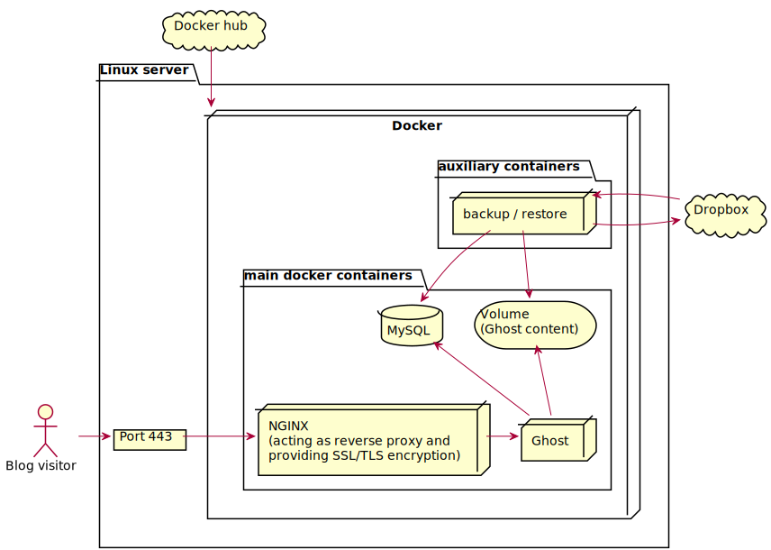

# Introduction
This repository contains the necessary code for deploying a [Ghost](https://en.wikipedia.org/wiki/Ghost_(blogging_platform)) blog to a VPS running Docker. It's capable of restoring existing contents (posts, theme) backed up to Dropbox.
## What you need
1. A Linux server with public IP where you want to deploy your Ghost blog.  
    * SSH daemon running with an authorised public SSH key. We could access with password instead, but it's safer not to have password authentication enabled.
    * Docker installed.
2. A domain name pointing to your server.
3. Optionally, if you want to restore a backup you need a Dropbox _access token_.
## What do we build

